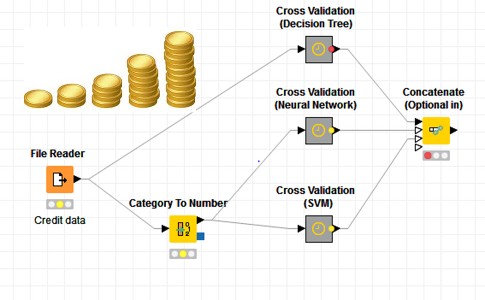
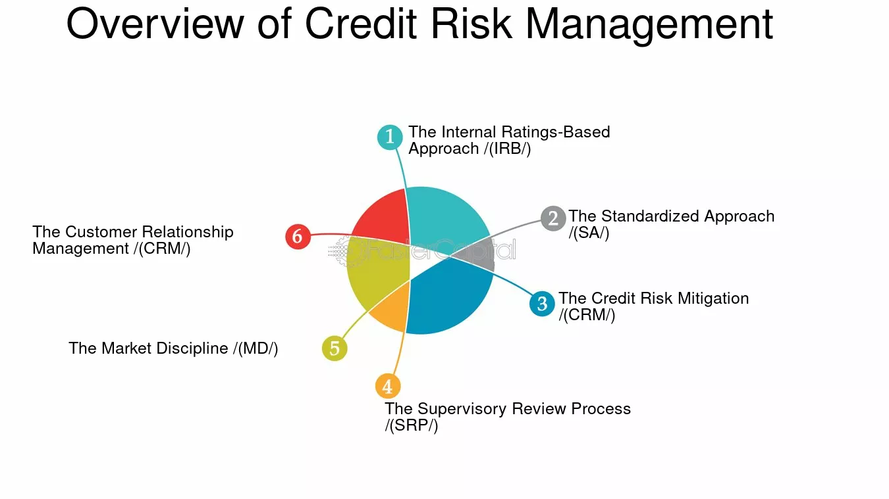

# Credit Scoring Business Understanding 

Credit Scoring Business Understanding
## 1. Influence of Basel II on Model Interpretability

The Basel II Accord emphasizes accurate risk measurement and mandates that financial institutions using internal ratings-based (IRB) approaches to calculate capital requirements must have transparent, well-documented, and interpretable models. This requirement ensures that both regulators and internal risk managers can understand and validate the underlying assumptions, data, and methodologies used to estimate key risk parameters like Probability of Default (PD), Loss Given Default (LGD), and Exposure at Default (EAD). Interpretability is critical not just for compliance but also for maintaining trust, accountability, and auditability within the institution and among external stakeholders.
## 2. Necessity and Risk of Using a Proxy Variable for Default

In many datasets, a direct indicator of default may not be available. In such cases, a proxy variable—such as “delinquency over 90 days” or repeated missed payments—must be created to approximate default behavior. While this enables model development, it introduces potential risks:

    Label Noise: The proxy may misrepresent actual default behavior, leading to biased or inaccurate predictions.

    Regulatory Risk: Decisions based on proxies may not align with regulatory definitions of default, risking non-compliance.

    Business Risk: Misclassification can lead to poor credit decisions—either granting loans to high-risk customers or denying credit to creditworthy ones—impacting both revenue and reputation.

Thus, the selection and justification of proxy variables must be done carefully, transparently, and with business alignment.
## 3. Trade-offs Between Simple and Complex Models

In a regulated financial environment, there is a significant trade-off between model complexity and interpretability:

    Simple Models (e.g., Logistic Regression with Weight of Evidence):

        Pros: Easy to explain, audit, and validate; compliant with regulatory requirements; suitable for risk-averse environments.

        Cons: May underperform in capturing nonlinear relationships or complex interactions in the data.

    Complex Models (e.g., Gradient Boosting Machines):

        Pros: Often provide higher predictive accuracy, capturing subtler patterns in borrower behavior.

        Cons: Difficult to interpret and justify; more prone to overfitting; challenging to validate under regulatory scrutiny.

In high-stakes financial applications, especially under Basel II/III, the preference often leans toward interpretable models that are robust, stable, and defensible in audits—even if they sacrifice some predictive performance.

### Credit Scoring Process Overview

